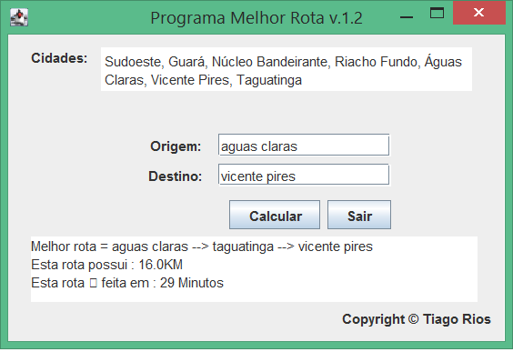

# Projeto melhor rota para a faculdade

Primeiro projeto com tela gráfica em java entregue na faculdade.

Desenvolvido em Março de 2017. java 1.5

## Sobre

O projeto original não utlizava ferramentas de build (Não as conhecia). As bibliotecas eram inseridas manualmente imagina ter que gerenciar todas as dependências transitivas. **Horrível demais**.

Não vou prosseguir com o projeto. Esta disponível no github somente para lembrar como foi o primeiro projeto com interface gráfica (java.swing) entregue na faculdade.

**Projeto agora utiliza o Maven.**

# Agradecimento

Perdão. Não me lembro quem me ajudou com o código na época. Procurei nos emails antigos e não encontrei. Não será possível lhe dar creditos.

Agradeço por ter compartilhado a sua implementação do algoritmo de Dijkstra.
